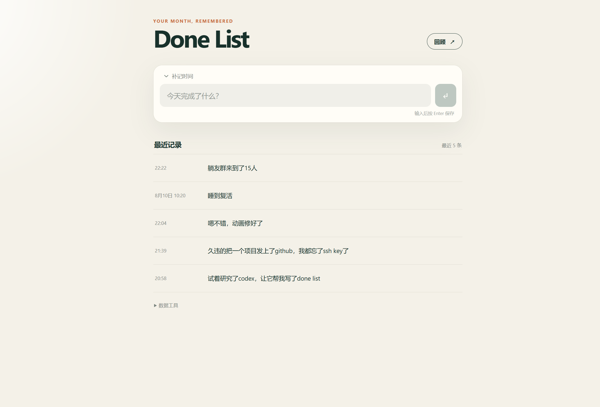
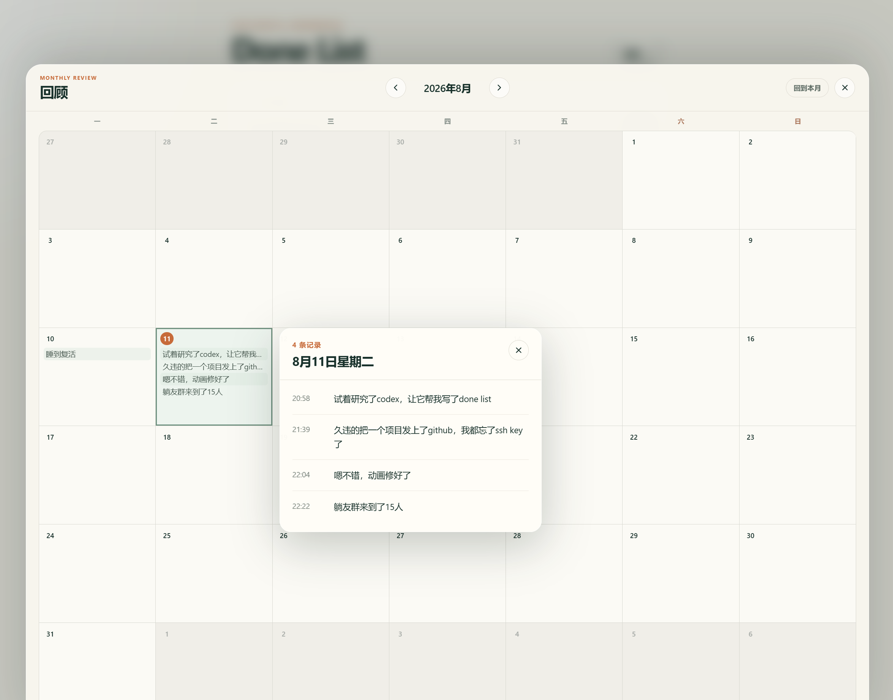

# Done List

这是一个 ChatGPT 帮我制作的快速记录工具。打开页面、输入一句话、按 Enter，记录会连同当前时间保存在浏览器的 IndexedDB 中。

## 当前功能

- 回车快速记录
- 可以手动选择时间进行补记
- 编辑记录内容和发生时间
- 删除记录
- 按月度进行完成事项回顾
- 导出和导入带版本号的 JSON 备份
- PWA 基础配置和生产环境离线缓存
- 独立 `RecordRepository` 数据访问层，方便以后替换为服务器 API

月历固定使用六周布局；桌面端日期详情显示在日格旁边，移动端自动切换为底部抽屉。

## 大概是啥样




## 本地运行

需要 Node.js 20.19+ 或 22.12+。

```bash
pnpm install
pnpm dev
```

浏览器访问终端显示的本地地址。

## 验证与构建

```bash
pnpm test
pnpm build
pnpm preview
```

构建产物位于 `dist/`，可以部署到任何静态网站服务器。IndexedDB 数据属于浏览器，不会包含在 `dist/` 中；迁移数据时请使用页面底部“数据工具”中的导出和导入功能。

## 数据结构

每条记录包含稳定 UUID，以及 `happenedAt`、`createdAt`、`updatedAt` 三个 ISO 时间字段。页面通过 `RecordRepository` 接口访问数据；未来增加服务器时，可以新增 `ApiRecordRepository` 而无需重写界面。
